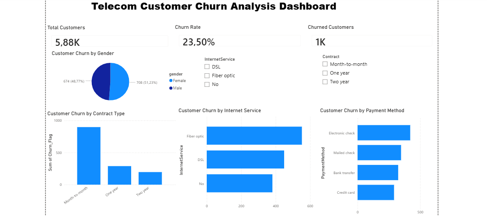

Telecom Customer Churn Analysis Dashboard

Project Overview

This project analyzes customer churn patterns in a telecommunications company using Power BI. The objective is to identify factors contributing to customer churn and provide insights that support customer retention strategies.

The dashboard presents key performance indicators (KPIs) and interactive visualizations that allow users to explore churn trends across contract types, internet services, payment methods, and customer demographics.

Dashboard Preview

Business Problem

Customer churn has a direct impact on revenue and profitability. Understanding why customers leave enables businesses to develop targeted retention campaigns and improve customer satisfaction.

This dashboard helps answer the following questions:

What is the overall customer churn rate?
Which contract types experience the highest churn?
Which internet service customers are most likely to leave?
Does payment method influence churn?
Is there a difference in churn between male and female customers?

Key Insights
Overall Metrics

Total Customers: 5,880
Churned Customers: 1,000
Churn Rate: 23.5%

Contract Type
Month-to-month customers show the highest churn levels.
Long-term contracts have significantly lower churn.

Internet Service
Fiber optic customers have the highest churn count.
Customers without internet service show lower churn.

Payment Method
Electronic check customers exhibit the highest churn.
Credit card customers show the lowest churn.

Gender
Churn distribution between male and female customers is relatively balanced.

Dashboard Features

KPI Cards
Total Customers
Churn Rate
Churned Customers

Visualizations

Customer Churn by Gender (Pie Chart)
Customer Churn by Contract Type (Column Chart)
Customer Churn by Internet Service (Bar Chart)
Customer Churn by Payment Method (Bar Chart)

Interactive Filters

Contract Type Slicer
Internet Service Slicer

Tools & Technologies

Power BI Desktop
DAX (Data Analysis Expressions)
Data Visualization
Business Intelligence Reporting

DAX Measures
Churn Rate

Churn Rate =
DIVIDE(
    SUM(churn_powerbi[Churn_Flag]),
    COUNT(churn_powerbi[customerID])
)

Skills Demonstrated

Data Cleaning and Preparation
Data Modeling
DAX Measure Creation
KPI Development
Dashboard Design
Interactive Reporting
Business Analysis
Data Visualization

Business Recommendations

Develop retention programs for month-to-month customers.
Investigate service quality issues affecting fiber optic customers.
Review customer experience associated with electronic check payments.
Introduce incentives for customers to move to longer-term contracts.

Author
Tinyiko Patience Mathebula

Tinyiko Patience Mathebula

